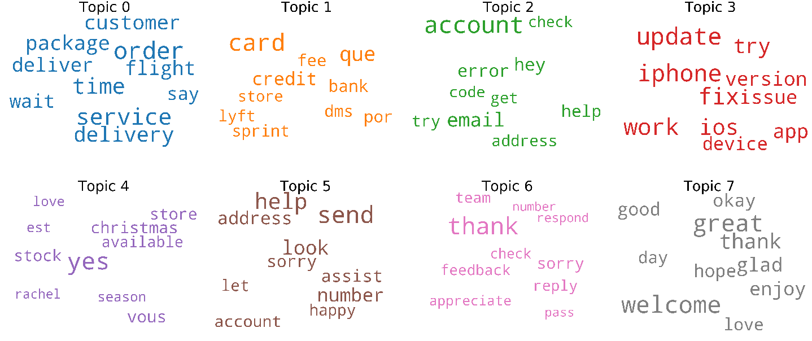

# Topic Modeling with TF\*IDF and LDA

These are my notebooks for the [I2A2](https://www.linkedin.com/company/institut-i2a2/) Topic Modeling presentation assignment. For this assignment I used common NLP techniques like [stopword](https://en.wikipedia.org/wiki/Stop_word) removal and [lemmatization](https://en.wikipedia.org/wiki/Lemmatisation) for text preprocessing, [bag of words](https://en.wikipedia.org/wiki/Bag-of-words_model), [TF\*IDF](https://en.wikipedia.org/wiki/Tf%E2%80%93idf) and [LDA](https://en.wikipedia.org/wiki/Latent_Dirichlet_allocation) for the actual model, common metrics like [distribution perplexity](https://en.wikipedia.org/wiki/Perplexity) & [coherence](http://svn.aksw.org/papers/2015/WSDM_Topic_Evaluation/public.pdf) and visualization tools like [wordclouds](https://en.wikipedia.org/wiki/Tag_cloud) and [pyLDAvis](https://github.com/bmabey/pyLDAvis).

These notebooks were developed and last updated Sep 2019. They are also available at Kaggle:

-   Twitter Support Dataset: https://www.kaggle.com/bryanlincoln/twitter-support-topic-modeling
-   Reddit Dataset: https://www.kaggle.com/bryanlincoln/reddit-topic-extraction
